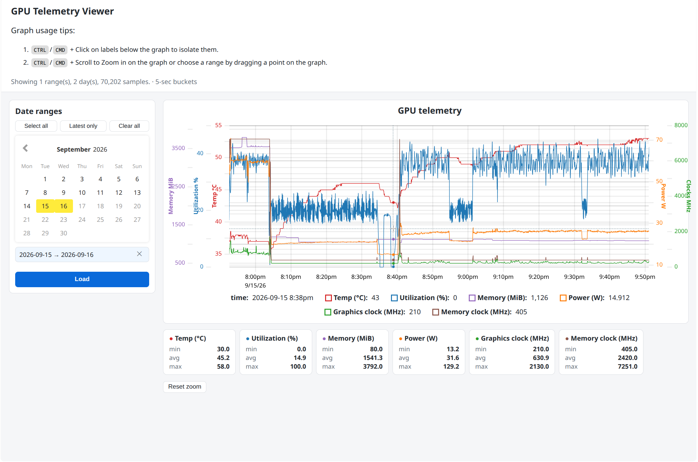

# GPU Telemetry Graph Viewer



A small vanilla-JS tool that visualizes the CSV logs produced by
`gpu-monitor.service`. It renders one second-resolution telemetry
(temperature, utilization, memory, power, and GPU/memory clocks) on an
interactive [uPlot](https://github.com/leeoniya/uPlot) chart with zoom,
pan, series toggles, and per-series min/avg/max stats.

## Prerequisites

- Node.js (for `npm` and the dev server)
- A local copy of the GPU logs (run `./copy-logs.sh` below; it reads
  `/var/log/gpu-monitor` by default)

## Install and run

```bash
cd docs/graphs
npm install
./copy-logs.sh          # or: ./copy-logs.sh /path/to/log/dir
npm start
```

Then open the printed URL (usually `http://localhost:3000`).

The server starts on port 3000 and automatically moves to the next free
port (up to 3020) if something else is already listening, so port
conflicts never block you.

## Usage

- Days with available logs appear as checkboxes; the most recent day is
  pre-selected.
- Check any combination of days and press **Load** to plot them on a
  shared timeline. Days are merged in time order, which makes gaps
  (system off, service stopped, freezes) visible.
- Drag horizontally to zoom, **Ctrl/Cmd + scroll** to zoom around the
  cursor, and **Reset zoom** to restore the full range.
- Click a series in the legend to hide/show it; the y-axes rescale to the
  visible series.
- The cards below the chart show min/avg/max per series over the loaded
  data (a quick way to spot the peaks the service was built to catch).

## Notes

- `docs/graphs/data/` and `node_modules/` are gitignored; each developer
  copies their own logs locally.
- Browsers block `fetch()` of local files, so the chart must be viewed
  through `npm start` (a tiny static server in `server.js`), not by
  opening `docs/index.html` directly.
- The service logs timestamps in the GPU service's configured timezone
  (`TZ` in `gpu-monitor.service`); the viewer parses them in your
  browser's local timezone. Times may appear shifted if the two differ.
- Logs contain `[N/A]` readings when the GPU can't report a value; these
  are rendered as gaps rather than zeros.

## Troubleshooting

- **"cannot read log directory"** — pass the source path explicitly
  (`./copy-logs.sh /path/to/logs`) or run `sudo ./copy-logs.sh` if the
  system log dir needs root.
- **"No CSV files in manifest"** — run `./copy-logs.sh` first; it copies
  the CSVs and generates `data/manifest.json`.
- **404 on `graphs/data/...`** — the data folder is local-only; re-run
  `./copy-logs.sh` after cloning the repo on a new machine.